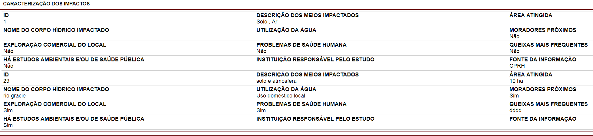

# Áreas Contaminadas / Passivos Ambientais

## Tela Inicial:


## Componentes:

### Visualização - Dados Gerais:


### Formulário - Dados Gerais:


### Banco - Dados Gerais:


```sql
CREATE TABLE areacontampassivoambiental
(
  idareacont serial NOT NULL,
  siglauf character varying(2),
  municipio character varying(50),
  baciahidrografica character varying(100),
  denominacaolocal character varying(50),
  logradouro character varying(100),
  numero integer,
  complemento character varying(20),
  bairrodistrito character varying(50),
  cep character varying(9),
  latcentroide character varying(20),
  longcentroide character varying(20),
  ematividade boolean,
  propriedade character varying(15),
  emprresponsavel character varying(100),
  fonteinformacao character varying(100),
  ativdesenvolvida character varying(100),
  fontecontaminacao character varying(100),
  outrasobservacoes character varying(2000),
  graurisco integer,
  tipologia character varying(60),
  CONSTRAINT pk_idareacont PRIMARY KEY (idareacont),
  CONSTRAINT fk_areacontampassivoambiental_municipio2007ibge1000k FOREIGN KEY (municipio)
      REFERENCES municipio2007ibge1000k (nm_nng) MATCH SIMPLE
      ON UPDATE NO ACTION ON DELETE NO ACTION,
  CONSTRAINT fk_areacontampassivoambiental_unidadefederativa FOREIGN KEY (siglauf)
      REFERENCES unidadefederativa (siglauf) MATCH SIMPLE
      ON UPDATE NO ACTION ON DELETE NO ACTION,
  CONSTRAINT chk_propriedade CHECK (propriedade::text = ANY (ARRAY['Área pública'::character varying::text, 'Área particular'::character varying::text]))
)
WITH (
  OIDS=FALSE
);
ALTER TABLE areacontampassivoambiental OWNER TO postgres;
GRANT ALL ON TABLE areacontampassivoambiental TO postgres;
GRANT SELECT, UPDATE, INSERT, DELETE ON TABLE areacontampassivoambiental TO "usuarioEditor";
GRANT SELECT ON TABLE areacontampassivoambiental TO usuarioweb;
```

**Obs**: substituir a tabela **municipio2007ibge**, que contém todos os municípios do brasil, por uma tabela espacial, contendo os municípios do estado de Pernambuco.


### Visualização - Caracterização dos Impactos:




### Formulário - Caracterização dos Impactos:

Uma área contaminada pode ter mais de uma caracterização de impactos (1:N).


### Banco - Caracterização dos Impactos:


**ERRO!** Não existe relacionamento com a tabela **areacontampassivoambiental**, porém existe um campo chamado **idareacont** contendo os ids dessa tabela.


```sql
CREATE TABLE meioimpactado
(
  idmeioimpactado serial NOT NULL,
  idareacont integer,
  meioimpactado character varying(500),
  areaatingida character varying(50),
  nomecorpohidrico character varying(150),
  tipocorpohidrico character varying(50),
  utilizacaoagua character varying(50),
  moradorproximo boolean,
  explcomercial boolean,
  problsaudehumana boolean,
  queixafrequente character varying(50),
  estudoambsaude boolean,
  instresponsavel character varying(50),
  areaha numeric(10,3),
  fonteinformacao character varying(100),
  outrasobservacoes character varying(2000),
  CONSTRAINT pk_idmeioimpactado PRIMARY KEY (idmeioimpactado),
  CONSTRAINT chk_tipocorpohidrimpactado CHECK (tipocorpohidrico::text = ANY (ARRAY['Rio'::character varying::text, 'Lago'::character varying::text, 'Águas subterrâneas'::character varying::text, 'Nenhum'::character varying::text])),
  CONSTRAINT chk_utilizacaoagua CHECK (utilizacaoagua::text = ANY (ARRAY['Uso doméstico local'::character varying::text, 'Captação'::character varying::text, 'Irrigação agrícola'::character varying::text, 'Não há uso'::character varying::text]))
)
WITH (
  OIDS=FALSE
);
ALTER TABLE meioimpactado OWNER TO postgres;
GRANT ALL ON TABLE meioimpactado TO postgres;
GRANT SELECT, UPDATE, INSERT, DELETE ON TABLE meioimpactado TO "usuarioEditor";
GRANT SELECT ON TABLE meioimpactado TO usuarioweb;
```


### Visualização - Caracterização do Produto Químico:

Uma área contaminada pode ter mais de uma caracterização de produto químico (1:N).


### Formulário - Caracterização do Produto Químico:


Este formulário possui um campo **Número ONU** (fk) com a relação dos produtos químicos perigosos da tabela **refprodutoperigoso** (ver abaixo):


```sql
CREATE TABLE refprodutoperigoso
(
  idrefprodperigoso serial NOT NULL,
  numonu integer,
  nomeproduto character varying,
  classerisco character varying(5),
  descrclasserisco character varying(300),
  numficha integer,
  CONSTRAINT pk_refprodutoperigoso PRIMARY KEY (idrefprodperigoso),
  CONSTRAINT fk_refprodutoperigoso_fichaprodutoquimico FOREIGN KEY (numficha)
      REFERENCES fichaprodutoquimico (idfichaprodutoquimico) MATCH SIMPLE
      ON UPDATE NO ACTION ON DELETE NO ACTION,
  CONSTRAINT uq_refprodutoperigoso_numonu UNIQUE (numonu)
)
WITH (
  OIDS=FALSE
);
ALTER TABLE refprodutoperigoso OWNER TO postgres;
GRANT ALL ON TABLE refprodutoperigoso TO postgres;
GRANT SELECT, UPDATE, INSERT, DELETE ON TABLE refprodutoperigoso TO "usuarioEditor";
GRANT SELECT ON TABLE refprodutoperigoso TO usuarioweb;
```


Formulário de atualização (update):


**OBS:**

O valor do campo **Forma de Armazenamento** parece estar errado, seguindo o tooltip sobre esse campo:

**Registro da forma de armazenamento do produto químico.** A seguir tem-se uma listagem das possíveis formas de armazenamento:

* (i) contêiner em depósito fechado;
* (ii) contêiner em depósito aberto;
* (iii) a céu aberto;
* (iv) tanque construído;
* (v) a granel em veículo-tanque;
* (vi) em contêiner em veículo-transportador;
* (vii) outra forma de armazenamento – especificar.


### Banco - Caracterização do Produto Químico:


```sql
CREATE TABLE produtoquimareacontaminada
(
  idprodquimareacont serial NOT NULL,
  idareacont integer,
  numonu integer,
  qtdenvolvida numeric,
  qtdunidade character varying(20),
  fabricantefornecedor character varying(50),
  formaarmazenamento character varying(50),
  "local" character varying(7),
  latitude character varying(15),
  longitude character varying(15),
  the_geom geometry,
  CONSTRAINT pk_idprodquimareacont PRIMARY KEY (idprodquimareacont),
  CONSTRAINT fk_numonuprodquimareacont_refprodutoperigoso FOREIGN KEY (numonu)
      REFERENCES refprodutoperigoso (numonu) MATCH SIMPLE
      ON UPDATE NO ACTION ON DELETE NO ACTION,
  CONSTRAINT chk_local CHECK (local::text = ANY (ARRAY['ex-situ'::character varying::text, 'in-situ'::character varying::text])),
  CONSTRAINT enforce_dims_the_geom CHECK (st_ndims(the_geom) = 2),
  CONSTRAINT enforce_geotype_the_geom CHECK (geometrytype(the_geom) = 'POINT'::text OR the_geom IS NULL),
  CONSTRAINT enforce_srid_the_geom CHECK (st_srid(the_geom) = 4291)
)
WITH (
  OIDS=FALSE
);
ALTER TABLE produtoquimareacontaminada OWNER TO postgres;
GRANT ALL ON TABLE produtoquimareacontaminada TO postgres;
GRANT SELECT, UPDATE, INSERT, DELETE ON TABLE produtoquimareacontaminada TO "usuarioEditor";
GRANT SELECT ON TABLE produtoquimareacontaminada TO usuarioweb;

-- Index: prodquimareacontam_gix

-- DROP INDEX prodquimareacontam_gix;

CREATE INDEX prodquimareacontam_gix
  ON produtoquimareacontaminada
  USING gist
  (the_geom);

```

### Visualização - Caracterização dos Resíduos:


### Formulário - Caracterização dos Resíduos:


O **Código do Resíduo** é o registro do nome do resíduo sólido, conforme Resolução CONAMA No 313/02 e ABNT NBR 10.004/2004.

Essa informação vem da tabela **refresiduo**. ESTA TABELA DEVE SER CRIADA DE FORMA IDÊNTICA E RELACIONADA COM A TABELA ABAIXO.

### Banco - Caracterização dos Resíduos:


```sql
CREATE TABLE residuoareacontampasamb
(
  idresareacontpasamb serial NOT NULL,
  idareacont integer,
  codresiduo character varying(10),
  qtdenvolvida numeric,
  qtdunidade character varying(30),
  formadispatual character varying(25),
  "local" character varying(7),
  latitude character varying(15),
  longitude character varying(15),
  the_geom geometry,
  CONSTRAINT pk_idresareacontpasamb PRIMARY KEY (idresareacontpasamb),
  CONSTRAINT fk_codresiduorefresiduo FOREIGN KEY (codresiduo)
      REFERENCES refresiduo (codresiduo) MATCH SIMPLE
      ON UPDATE NO ACTION ON DELETE NO ACTION,
  CONSTRAINT chk_local CHECK (local::text = ANY (ARRAY['ex-situ'::character varying::text, 'in-situ'::character varying::text])),
  CONSTRAINT enforce_dims_the_geom CHECK (st_ndims(the_geom) = 2),
  CONSTRAINT enforce_geotype_the_geom CHECK (geometrytype(the_geom) = 'POINT'::text OR the_geom IS NULL),
  CONSTRAINT enforce_srid_the_geom CHECK (st_srid(the_geom) = 4291)
)
WITH (
  OIDS=FALSE
);
ALTER TABLE residuoareacontampasamb OWNER TO postgres;
GRANT ALL ON TABLE residuoareacontampasamb TO postgres;
GRANT SELECT, UPDATE, INSERT, DELETE ON TABLE residuoareacontampasamb TO "usuarioEditor";
GRANT SELECT ON TABLE residuoareacontampasamb TO usuarioweb;

-- Index: resareacontpasamb_gix

-- DROP INDEX resareacontpasamb_gix;

CREATE INDEX resareacontpasamb_gix
  ON residuoareacontampasamb
  USING gist
  (the_geom);
```

### Visualização - Estrutura de Contenção e Instrumentos de Gestão Ambiental:


### Formulário - Estrutura de Contenção e Instrumentos de Gestão Ambiental:


### Banco - Estrutura de Contenção e Instrumentos de Gestão Ambiental:

Pode ter mais de uma estrutura (1:N).


```sql
CREATE TABLE estrutcontinstrgestambareacontam
(
  idestcontinstgestambcont serial NOT NULL,
  idareacont integer,
  estrutcontencao character varying(200),
  sistmonitoramento character varying(200),
  planemergencia character varying(200),
  medidaremediacao character varying(200),
  situacaolicambiental character varying(30),
  CONSTRAINT pk_idestcontinstgestambareacont PRIMARY KEY (idestcontinstgestambcont),
  CONSTRAINT chk_sitlicamb CHECK (situacaolicambiental::text = ANY (ARRAY['Licença Prévia'::character varying::text, 'Licença de Instalação'::character varying::text, 'Licença de Operação'::character varying::text, 'Não Licenciado'::character varying::text, 'Licença em Fase de Renovação'::character varying::text, 'Licença Solicitada'::character varying::text, 'Sem licenças válidas'::character varying::text]))
)
WITH (
  OIDS=FALSE
);
ALTER TABLE estrutcontinstrgestambareacontam OWNER TO postgres;
GRANT ALL ON TABLE estrutcontinstrgestambareacontam TO postgres;
GRANT SELECT, UPDATE, INSERT, DELETE ON TABLE estrutcontinstrgestambareacontam TO "usuarioEditor";
GRANT SELECT ON TABLE estrutcontinstrgestambareacontam TO usuarioweb;

```

[voltar para o Início][0]

[0]:README.md