# Atividades Comerciais / Industriais (Fixas)

## Tela Inicial:

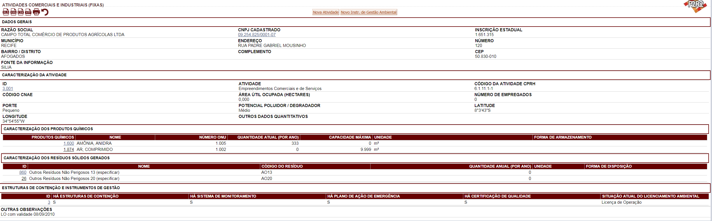


## Componentes:

### Visualização - Dados Gerais:

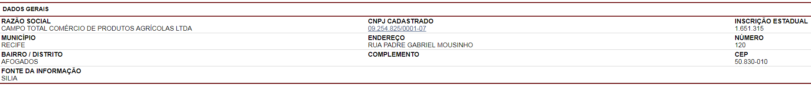

### Formulário - Dados Gerais:
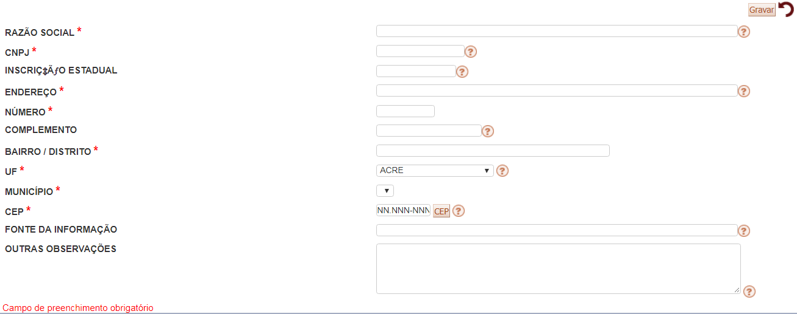


### Banco - Dados Gerais:
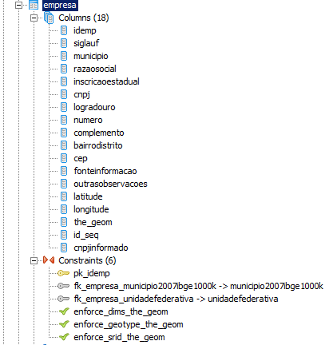


Existe uma certa incoerência na modelagem, temos dois tipos de empresa: 

* Empresa Fixa
* Empresa Transporte

Observar isso e melhorar a modelagem deste problema no Django.

Um outro detalhe importante, a empresa pode ter N empreendimentos. Normalmente o empreendimento é a fonte poluidora, logo deve ser adicionado no algoritmo p2r2.

Ainda não vi (não terminei a análise) se existe uma tabela empreendimento.

```sql
CREATE TABLE empresa
(
  idemp serial NOT NULL,
  siglauf character varying(2),
  municipio character varying(50),
  razaosocial character varying(100),
  inscricaoestadual numeric(16,0),
  cnpj numeric(14,0),
  logradouro character varying(100),
  numero integer,
  complemento character varying(20),
  bairrodistrito character varying(50),
  cep character varying(8),
  fonteinformacao character varying(100),
  outrasobservacoes character varying,
  latitude character varying(15),
  longitude character varying(15),
  the_geom geometry,
  id_seq character varying(10),
  cnpjinformado character varying(14),
  CONSTRAINT pk_idemp PRIMARY KEY (idemp),
  CONSTRAINT fk_empresa_municipio2007ibge1000k FOREIGN KEY (municipio)
      REFERENCES municipio2007ibge1000k (nm_nng) MATCH SIMPLE
      ON UPDATE NO ACTION ON DELETE NO ACTION,
  CONSTRAINT fk_empresa_unidadefederativa FOREIGN KEY (siglauf)
      REFERENCES unidadefederativa (siglauf) MATCH SIMPLE
      ON UPDATE NO ACTION ON DELETE NO ACTION,
  CONSTRAINT enforce_dims_the_geom CHECK (st_ndims(the_geom) = 2),
  CONSTRAINT enforce_geotype_the_geom CHECK (geometrytype(the_geom) = 'POINT'::text OR the_geom IS NULL),
  CONSTRAINT enforce_srid_the_geom CHECK (st_srid(the_geom) = 4291)
)
WITH (
  OIDS=FALSE
);
ALTER TABLE empresa OWNER TO postgres;
GRANT ALL ON TABLE empresa TO postgres;
GRANT SELECT, UPDATE, INSERT, DELETE ON TABLE empresa TO "usuarioEditor";
GRANT SELECT ON TABLE empresa TO usuarioweb;
```

### Visualização - Caracterização da Atividade:

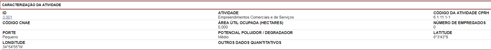


### Formulário - Caracterização da Atividade:

Não abre, apresenta problema.


### Banco - Caracterização da Atividade:

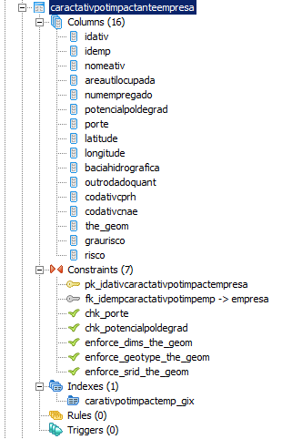

```sql
CREATE TABLE caractativpotimpactanteempresa
(
  idativ serial NOT NULL,
  idemp integer,
  nomeativ character varying(200),
  areautilocupada numeric(10,3),
  numempregado integer,
  potencialpoldegrad character varying(20),
  porte character varying(13),
  latitude character varying(15),
  longitude character varying(15),
  baciahidrografica character varying(100),
  outrodadoquant character varying(100),
  codativcprh character varying(15),
  codativcnae character varying(15),
  the_geom geometry,
  graurisco integer,
  risco character varying(150),
  CONSTRAINT pk_idativcaractativpotimpactempresa PRIMARY KEY (idativ),
  CONSTRAINT fk_idempcaractativpotimpemp FOREIGN KEY (idemp)
      REFERENCES empresa (idemp) MATCH SIMPLE
      ON UPDATE NO ACTION ON DELETE NO ACTION,
  CONSTRAINT chk_porte CHECK (porte::text = ANY (ARRAY['Pequeno'::character varying::text, 'Médio'::character varying::text, 'Grande'::character varying::text, 'Não Informado'::character varying::text])),
  CONSTRAINT chk_potencialpoldegrad CHECK (potencialpoldegrad::text = ANY (ARRAY['Pequeno'::character varying::text, 'Médio'::character varying::text, 'Grande'::character varying::text, 'A ser classificado'::character varying::text])),
  CONSTRAINT enforce_dims_the_geom CHECK (st_ndims(the_geom) = 2),
  CONSTRAINT enforce_geotype_the_geom CHECK (geometrytype(the_geom) = 'POINT'::text OR the_geom IS NULL),
  CONSTRAINT enforce_srid_the_geom CHECK (st_srid(the_geom) = 4291)
)
WITH (
  OIDS=FALSE
);
ALTER TABLE caractativpotimpactanteempresa OWNER TO postgres;
GRANT ALL ON TABLE caractativpotimpactanteempresa TO postgres;
GRANT SELECT, UPDATE, INSERT, DELETE ON TABLE caractativpotimpactanteempresa TO "usuarioEditor";
GRANT SELECT ON TABLE caractativpotimpactanteempresa TO usuarioweb;

-- Index: carativpotimpactemp_gix

-- DROP INDEX carativpotimpactemp_gix;

CREATE INDEX carativpotimpactemp_gix
  ON caractativpotimpactanteempresa
  USING gist
  (the_geom);
```


A empresa pode ter mais de uma atividade (1:n).


### Visualização - Caracterização dos Produtos Químicos:

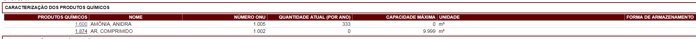

### Formulário - Caracterização dos Produtos Químicos:

Podemos cadastrar vários produtos químicos aqui. Recebe o Número ONU.

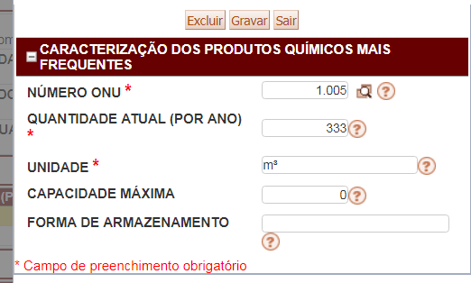


### Banco - Caracterização dos Produtos Químicos:

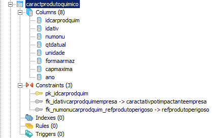

```sql
CREATE TABLE caractprodutoquimico
(
  idcarprodquim serial NOT NULL,
  idativ integer,
  numonu integer,
  qtdatual numeric,
  unidade character varying(20),
  formaarmaz character varying(100),
  capmaxima numeric,
  ano integer DEFAULT 2003,
  CONSTRAINT pk_idcarprodquim PRIMARY KEY (idcarprodquim),
  CONSTRAINT fk_idativcarprodquimempresa FOREIGN KEY (idativ)
      REFERENCES caractativpotimpactanteempresa (idativ) MATCH SIMPLE
      ON UPDATE NO ACTION ON DELETE NO ACTION,
  CONSTRAINT fk_numonucarprodquim_refprodutoperigoso FOREIGN KEY (numonu)
      REFERENCES refprodutoperigoso (numonu) MATCH SIMPLE
      ON UPDATE NO ACTION ON DELETE NO ACTION
)
WITH (
  OIDS=FALSE
);
ALTER TABLE caractprodutoquimico OWNER TO postgres;
GRANT ALL ON TABLE caractprodutoquimico TO postgres;
GRANT SELECT, UPDATE, INSERT, DELETE ON TABLE caractprodutoquimico TO "usuarioEditor";
GRANT SELECT ON TABLE caractprodutoquimico TO usuarioweb;
```

### Visualização - Estruturas de Contenção e Instrumentos de  Gestão:

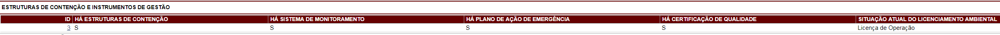


### Formulário - Estruturas de Contenção e Instrumentos de  Gestão:

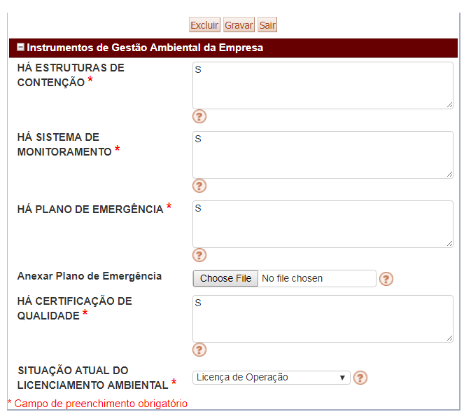


### Tabela - Estruturas de Contenção e Instrumentos de  Gestão:

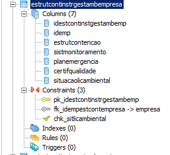


```sql
CREATE TABLE estrutcontinstrgestambempresa
(
  idestcontinstgestambemp serial NOT NULL,
  idemp integer,
  estrutcontencao character varying(200),
  sistmonitoramento character varying(200),
  planemergencia character varying(200),
  certifqualidade character varying(200),
  situacaolicambiental character varying(30),
  CONSTRAINT pk_idestcontinstrgestambemp PRIMARY KEY (idestcontinstgestambemp),
  CONSTRAINT fk_idempestcontempresa FOREIGN KEY (idemp)
      REFERENCES empresa (idemp) MATCH SIMPLE
      ON UPDATE NO ACTION ON DELETE NO ACTION,
  CONSTRAINT chk_sitlicambiental CHECK (situacaolicambiental::text = ANY (ARRAY['Licença Prévia'::character varying::text, 'Licença de Instalação'::character varying::text, 'Licença de Operação'::character varying::text, 'Não Licenciado'::character varying::text, 'Licença em Fase de Renovação'::character varying::text, 'Licença Solicitada'::character varying::text, 'Sem licenças válidas'::character varying::text]))
)
WITH (
  OIDS=FALSE
);
ALTER TABLE estrutcontinstrgestambempresa OWNER TO postgres;
GRANT ALL ON TABLE estrutcontinstrgestambempresa TO postgres;
GRANT SELECT, UPDATE, INSERT, DELETE ON TABLE estrutcontinstrgestambempresa TO "usuarioEditor";
GRANT SELECT ON TABLE estrutcontinstrgestambempresa TO usuarioweb;

```


