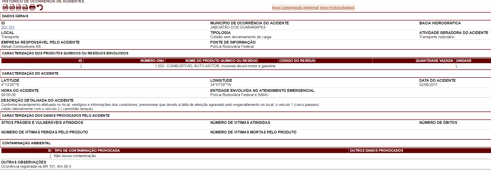
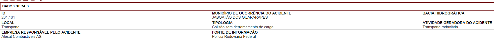
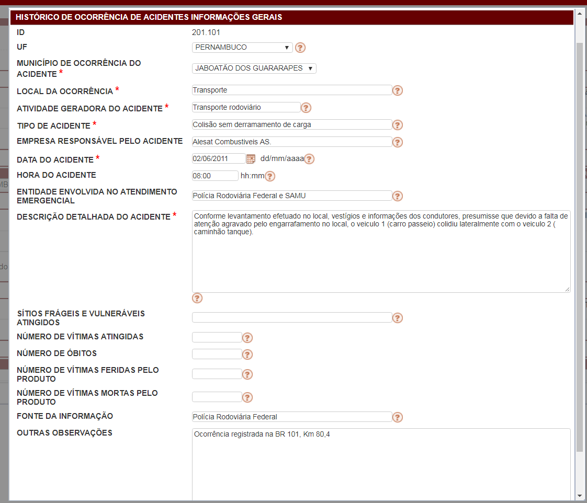
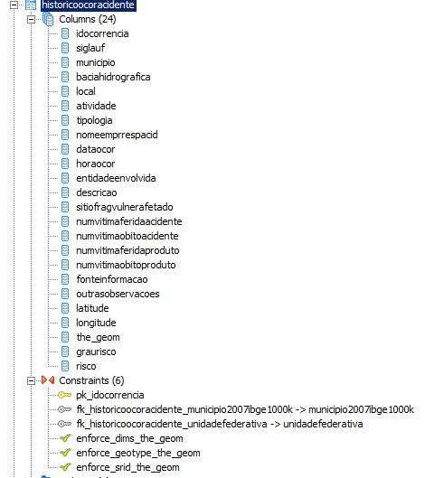
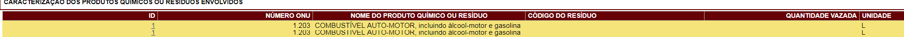
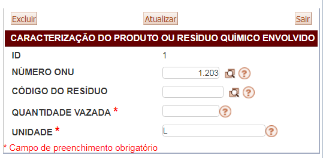
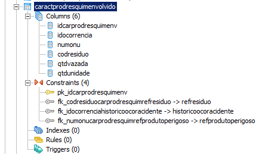
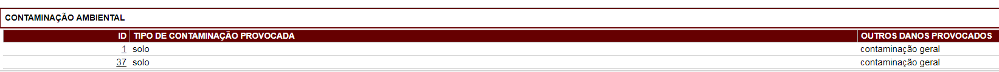
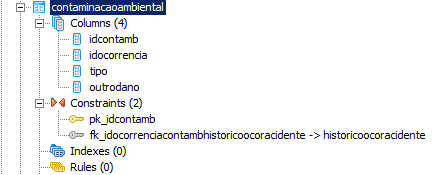

# Histórico de Ocorrência de Acidentes


## Tela Inicial:


## Componentes:

### Visualização - Dados Gerais:




### Formulário - Dados Gerais:



### Banco - Dados Gerais:


```sql
CREATE TABLE historicoocoracidente
(
  idocorrencia serial NOT NULL,
  siglauf character varying(2),
  municipio character varying(50),
  baciahidrografica character varying(100),
  "local" character varying(50),
  atividade character varying(25),
  tipologia character varying(50),
  nomeemprrespacid character varying(100),
  dataocor date,
  horaocor time without time zone,
  entidadeenvolvida character varying(50),
  descricao character varying,
  sitiofragvulnerafetado character varying(200),
  numvitimaferidaacidente integer,
  numvitimaobitoacidente integer,
  numvitimaferidaproduto integer,
  numvitimaobitoproduto integer,
  fonteinformacao character varying(100),
  outrasobservacoes character varying,
  latitude character varying(15),
  longitude character varying(15),
  the_geom geometry,
  graurisco integer,
  risco character varying(150),
  CONSTRAINT pk_idocorrencia PRIMARY KEY (idocorrencia),
  CONSTRAINT fk_historicoocoracidente_municipio2007ibge1000k FOREIGN KEY (municipio)
      REFERENCES municipio2007ibge1000k (nm_nng) MATCH SIMPLE
      ON UPDATE NO ACTION ON DELETE NO ACTION,
  CONSTRAINT fk_historicoocoracidente_unidadefederativa FOREIGN KEY (siglauf)
      REFERENCES unidadefederativa (siglauf) MATCH SIMPLE
      ON UPDATE NO ACTION ON DELETE NO ACTION,
  CONSTRAINT enforce_dims_the_geom CHECK (st_ndims(the_geom) = 2),
  CONSTRAINT enforce_geotype_the_geom CHECK (geometrytype(the_geom) = 'POINT'::text OR the_geom IS NULL),
  CONSTRAINT enforce_srid_the_geom CHECK (st_srid(the_geom) = 4291)
)
WITH (
  OIDS=FALSE
);
```

### Visualização - Produto / Resíduo:




### Formulário - Produto / Resíduo:




### Banco - Produto / Resíduo:



```sql
CREATE TABLE caractprodresquimenvolvido
(
  idcarprodresquimenv serial NOT NULL,
  idocorrencia integer,
  numonu integer,
  codresiduo character varying(10),
  qtdvazada numeric,
  qtdunidade character varying(20),
  CONSTRAINT pk_idcarprodresquimenv PRIMARY KEY (idcarprodresquimenv),
  CONSTRAINT fk_codresiduocarprodresquimrefresiduo FOREIGN KEY (codresiduo)
      REFERENCES refresiduo (codresiduo) MATCH SIMPLE
      ON UPDATE NO ACTION ON DELETE NO ACTION,
  CONSTRAINT fk_idocorrenciahistoricoocoracidente FOREIGN KEY (idocorrencia)
      REFERENCES historicoocoracidente (idocorrencia) MATCH SIMPLE
      ON UPDATE NO ACTION ON DELETE NO ACTION,
  CONSTRAINT fk_numonucarprodresquimrefprodutoperigoso FOREIGN KEY (numonu)
      REFERENCES refprodutoperigoso (numonu) MATCH SIMPLE
      ON UPDATE NO ACTION ON DELETE NO ACTION
)
WITH (
  OIDS=FALSE
);
ALTER TABLE caractprodresquimenvolvido OWNER TO postgres;
GRANT ALL ON TABLE caractprodresquimenvolvido TO postgres;
GRANT SELECT, UPDATE, INSERT, DELETE ON TABLE caractprodresquimenvolvido TO "usuarioEditor";
GRANT SELECT ON TABLE caractprodresquimenvolvido TO usuarioweb;
```

### Visualização - Contaminação Ambiental:




### Formulário - Contaminação Ambiental:


### Banco - Contaminação Ambiental:



```sql
CREATE TABLE contaminacaoambiental
(
  idcontamb serial NOT NULL,
  idocorrencia integer,
  tipo character varying(50),
  outrodano character varying(100),
  CONSTRAINT pk_idcontamb PRIMARY KEY (idcontamb),
  CONSTRAINT fk_idocorrenciacontambhistoricoocoracidente FOREIGN KEY (idocorrencia)
      REFERENCES historicoocoracidente (idocorrencia) MATCH SIMPLE
      ON UPDATE NO ACTION ON DELETE NO ACTION
)
WITH (
  OIDS=FALSE
);
ALTER TABLE contaminacaoambiental OWNER TO postgres;
GRANT ALL ON TABLE contaminacaoambiental TO postgres;
GRANT SELECT, UPDATE, INSERT, DELETE ON TABLE contaminacaoambiental TO "usuarioEditor";
GRANT SELECT ON TABLE contaminacaoambiental TO usuarioweb;
```


