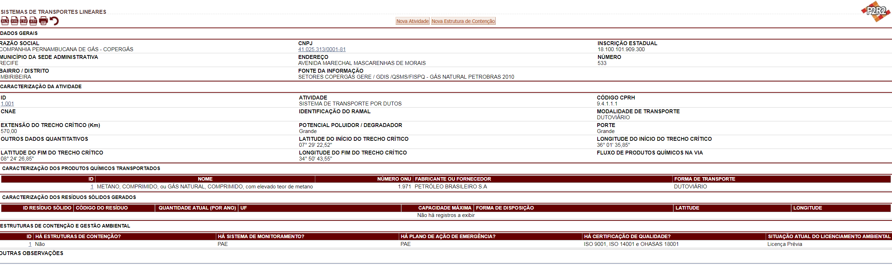
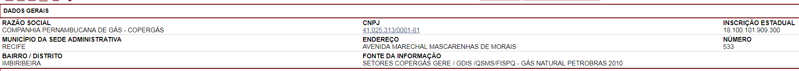
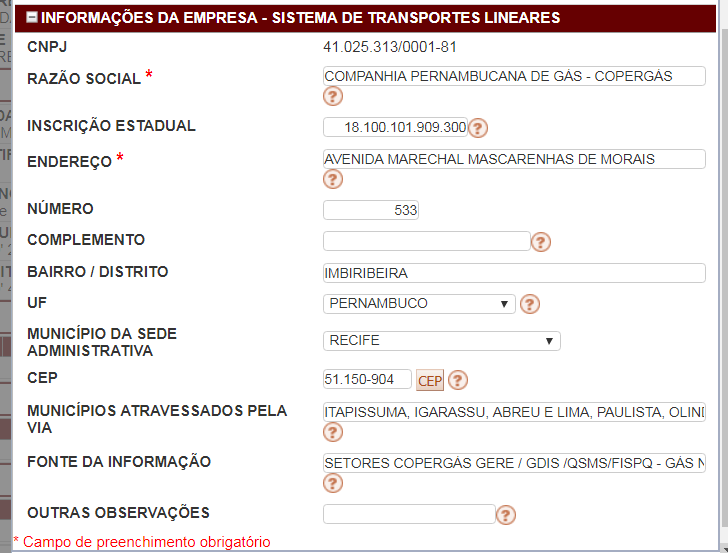
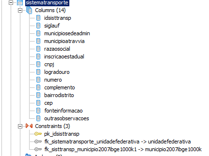
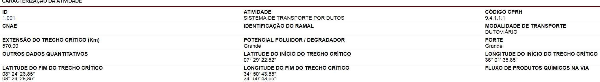
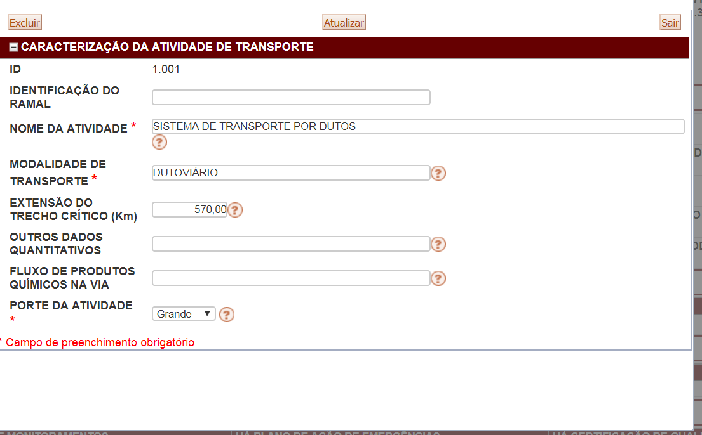
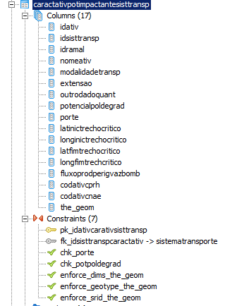
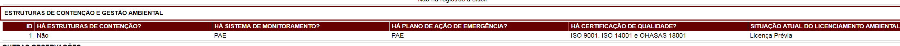
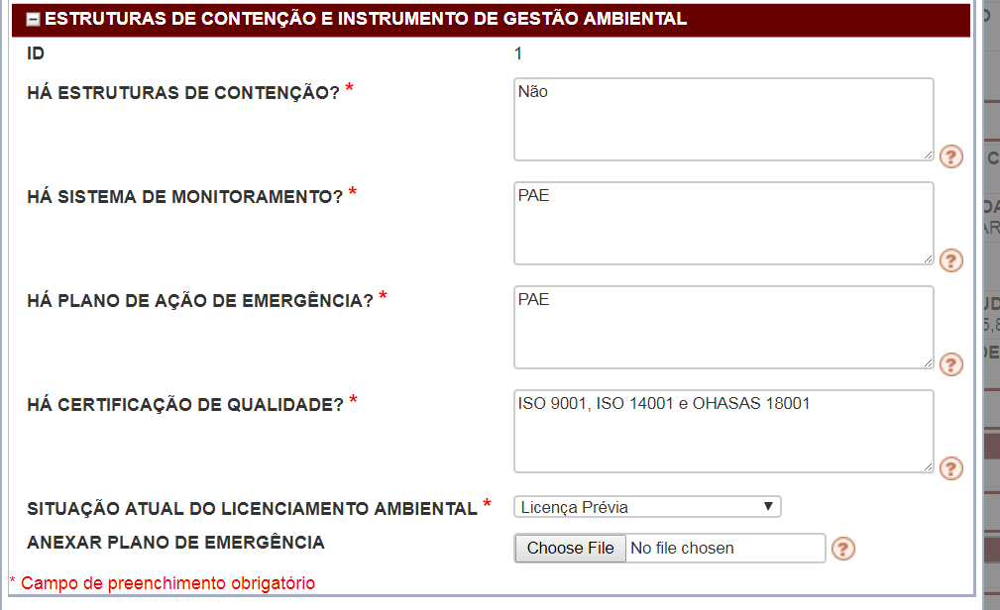
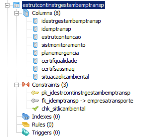

# Sistema de Trnasportes Lineares

## Tela Inicial:




## Componentes:

### Visualização - Dados Gerais:




### Formulário - Dados Gerais:



### Banco - Dados Gerais:



```sql
CREATE TABLE sistematransporte
(
  idsisttransp serial NOT NULL,
  siglauf character varying(2),
  municipiosedeadmin character varying(50),
  municipioatravvia character varying(255),
  razaosocial character varying(100),
  inscricaoestadual numeric(16,0),
  cnpj numeric(14,0),
  logradouro character varying(100),
  numero integer,
  complemento character varying(25),
  bairrodistrito character varying(50),
  cep character varying(9),
  fonteinformacao character varying(1000),
  outrasobservacoes character varying,
  CONSTRAINT pk_idsisttransp PRIMARY KEY (idsisttransp),
  CONSTRAINT fk_sistematransporte_unidadefederativa FOREIGN KEY (siglauf)
      REFERENCES unidadefederativa (siglauf) MATCH SIMPLE
      ON UPDATE NO ACTION ON DELETE NO ACTION,
  CONSTRAINT fk_sisttransp_municipio2007ibge1000k1 FOREIGN KEY (municipiosedeadmin)
      REFERENCES municipio2007ibge1000k (nm_nng) MATCH SIMPLE
      ON UPDATE NO ACTION ON DELETE NO ACTION
)
WITH (
  OIDS=FALSE
);
ALTER TABLE sistematransporte OWNER TO postgres;
GRANT ALL ON TABLE sistematransporte TO postgres;
GRANT SELECT, UPDATE, INSERT, DELETE ON TABLE sistematransporte TO "usuarioEditor";
GRANT SELECT ON TABLE sistematransporte TO usuarioweb;

```

### Visualização - Caracteziração da Atividade:



### Formulário - Caracteziração da Atividade:




### Banco - Caracteziração da Atividade:



```sql
CREATE TABLE caractativpotimpactantesisttransp
(
  idativ serial NOT NULL,
  idsisttransp integer,
  idramal character varying(100),
  nomeativ character varying(200),
  modalidadetransp character varying(50),
  extensao numeric(10,2),
  outrodadoquant character varying(100),
  potencialpoldegrad character varying(20),
  porte character varying(7),
  latinictrechocritico character varying(15),
  longinictrechocritico character varying(15),
  latfimtrechocritico character varying(15),
  longfimtrechcritico character varying(15),
  fluxoprodperigvazbomb character varying(50),
  codativcprh character varying(12),
  codativcnae character varying(12),
  the_geom geometry,
  CONSTRAINT pk_idativcarativsisttransp PRIMARY KEY (idativ),
  CONSTRAINT fk_idsisttranspcaractativ FOREIGN KEY (idsisttransp)
      REFERENCES sistematransporte (idsisttransp) MATCH SIMPLE
      ON UPDATE NO ACTION ON DELETE NO ACTION,
  CONSTRAINT chk_porte CHECK (porte::text = ANY (ARRAY['Pequeno'::character varying::text, 'Médio'::character varying::text, 'Grande'::character varying::text])),
  CONSTRAINT chk_potpoldegrad CHECK (potencialpoldegrad::text = ANY (ARRAY['Pequeno'::character varying::text, 'Médio'::character varying::text, 'Grande'::character varying::text, 'A ser classificado'::character varying::text])),
  CONSTRAINT enforce_dims_the_geom CHECK (st_ndims(the_geom) = 2),
  CONSTRAINT enforce_geotype_the_geom CHECK (geometrytype(the_geom) = 'MULTILINESTRING'::text OR the_geom IS NULL),
  CONSTRAINT enforce_srid_the_geom CHECK (st_srid(the_geom) = 4291)
)
```

### Visualização - Estruturas de Contenção e Gestão Ambiental:




### Formulário - Estruturas de Contenção e Gestão Ambiental:




### Banco - Estruturas de Contenção e Gestão Ambiental:




```sql
CREATE TABLE estrutcontinstrgestambemptransp
(
  idestrgestambemptransp serial NOT NULL,
  idemptransp integer,
  estrutcontencao character varying(200),
  sistmonitoramento character varying(200),
  planemergencia character varying(200),
  certifqualidade character varying(200),
  certifsassmaq character varying(200),
  situacaolicambiental character varying(30),
  CONSTRAINT pk_idestrcontinstrgestambemptransp PRIMARY KEY (idestrgestambemptransp),
  CONSTRAINT fk_idemptransp FOREIGN KEY (idemptransp)
      REFERENCES empresatransporte (idemptransp) MATCH SIMPLE
      ON UPDATE NO ACTION ON DELETE NO ACTION,
  CONSTRAINT chk_sitlicambiental CHECK (situacaolicambiental::text = ANY (ARRAY['Licença Prévia'::character varying::text, 'Licença de Instalação'::character varying::text, 'Licença de Operação'::character varying::text, 'Não Licenciado'::character varying::text, 'Licença em Fase de Renovação'::character varying::text, 'Licença Solicitada'::character varying::text, 'Sem licenças válidas'::character varying::text]))
)
WITH (
  OIDS=FALSE
);
```


