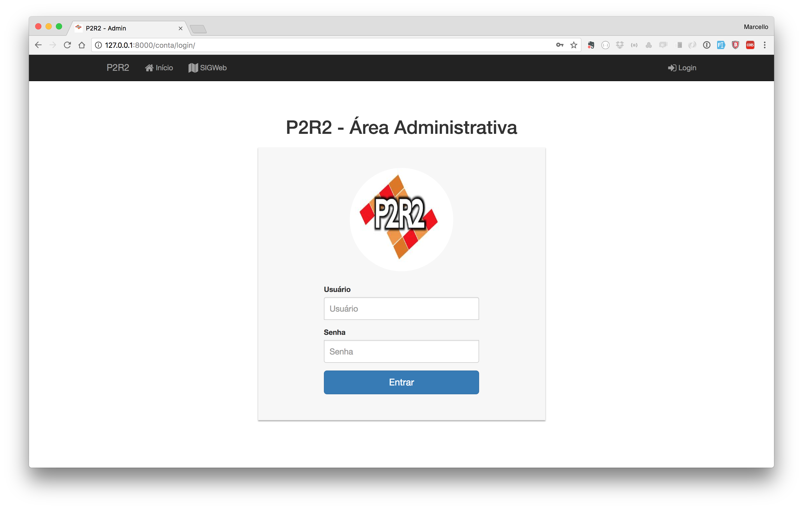

# Relatório de Andamento

Ressalta-se que nesta etapa de desenvolvimento do sistema, os esforços estão sendo concentrados na elaboração dos formulários que compõem o sistema, e dessa forma, a parte relacionada ao embelzamento e design do sistema ainda não está sendo desenvolvida.

Serão listados abaixos as funcionalidades já existentes no novo sistema P2R2.

## 1. Tela de Login do Sistema

Através desta tela os usuários que terão acesso poderão se logar no sistema para efetuar as mais diversas operações.

Ainda não forma implementadas as opções de realização de cadastro e recuperação de senha, já que o objetivo nesse momento foi criar no sistema os itens que compõem a aplicação **Áreas Contamindadas / Passivos Ambientais**, que sera descrita a seguir neste documento. 	

## 2. Painel Administrativo (Dashboard)

Após o login no sistema, o usuário autenticado verá o painel admininstrativo, onde é possível escolher por onde será feita a navegação do sistema. Ressaltasse que apenas os usuários autenticados poderão realizar alterações sobre os temas a seguir.

O Painel administrativo terá seu layout separado por temas, sendo eles os seguintes:

1. Áreas Contamindadas / Passivos Ambientais: este item do sistema diz respeito a caracterização dos locais de disposição (aterros e lixões) de resíduos sólidos identificados e dos seus respectivos passivos ambientais;
2. Atividades Comerciais e Industriais: diz respeito ao cadastramento de atividades comerciais e industriais que envolvem a manipulação de produtos químicos perigosos;
3. Histórico de Ocorrência de Acidentes: são os dados sobre data e localização dos acidentes ambientais
4. Sistema de Transportes Lineares: diz respeito aos dados das empresas de transporte de substâncias perigosas de forma linear
5. Sítios Frágeis e Vulneráveis: são os dados referentes aos seguintes elementos:
	* Assentamento humano
	* Captação de Água
	* Recarga de Aquífero
	* Recurso Hídrico Representativo
	* unidades de Conservação
	* Área de Proteção de Mananciais
6. Transporte Terrestre de Substâncias perigosas: cadastro de atividades industriais e comerciais que envolvem o transporte de produtos químicos perigosos
7. Unidades de Respostas a Acidentes: contempla todas as entidades capazes de prestar serviços no atendimento a um eventual acidente/incidente envolvendo produto químico

## 3. Áreas Contamindadas / Passivos Ambientais

O usuário ao clicar neste item do sistema, verá a tela abaixo:

### 3.1 - Dados Gerais:

Nesta tela serão preenchidos os dados gerais referented ao cadastro das áreas contaminadas.

Uma vez preenchidos os dados,

