# Relatório de Andamento

Ressalta-se que nesta etapa de desenvolvimento do sistema, os esforços estão sendo concentrados na elaboração dos formulários que compõem o sistema, e dessa forma, a parte relacionada ao embelezamento e design do sistema ainda não está sendo desenvolvida.

Serão listados abaixos as funcionalidades já existentes no novo sistema P2R2.

## 1. Tela de Login do Sistema

Através desta tela os usuários que terão acesso poderão se logar no sistema para efetuar as mais diversas operações.

Ainda não foram implementadas as opções de realização de cadastro e recuperação de senha, já que o objetivo nesse momento foi criar no sistema os itens que compõem a aplicação **Áreas Contaminadas / Passivos Ambientais**, que será descrita a seguir neste documento. 	

## 2. Painel Administrativo (Dashboard)

Após o login no sistema, o usuário autenticado verá o painel administrativo, onde é possível escolher por onde será feita a navegação do sistema. Ressaltasse que apenas os usuários autenticados poderão realizar alterações sobre os temas a seguir.

O Painel administrativo terá seu layout separado por temas, sendo eles os seguintes:

1. **Áreas Contamindadas / Passivos Ambientais**: este item do sistema diz respeito a caracterização dos locais de disposição (aterros e lixões) de resíduos sólidos identificados e dos seus respectivos passivos ambientais;
2. **Atividades Comerciais e Industriais**: diz respeito ao cadastramento de atividades comerciais e industriais que envolvem a manipulação de produtos químicos perigosos;
3. **Histórico de Ocorrência de Acidentes**: são os dados sobre data e localização dos acidentes ambientais;
4. **Sistema de Transportes Lineares**: diz respeito aos dados das empresas de transporte de substâncias perigosas de forma linear;
5. **Transporte Terrestre de Substâncias perigosas**: cadastro de atividades industriais e comerciais que envolvem o transporte de produtos químicos perigosos;
6. **Unidades de Respostas a Acidentes**: contempla todas as entidades capazes de prestar serviços no atendimento a um eventual acidente/incidente envolvendo produto químico
7. **Sítios Frágeis e Vulneráveis**: são os dados referentes aos seguintes elementos do sistema:
	* Assentamento humano;
	* Captação de Água;
	* Recarga de Aquífero;
	* Recurso Hídrico Representativo;
	* unidades de Conservação;
	* Área de Proteção de Mananciais.

8. **Tabelas Auxiliares**: são todas as outras tabelas auxiliares, que guardam os de tipos de dados das tabelas que compõem o sistema, atualmente, o sistema conta com as seguintes tabelas auxiliares:

* **Atividades Desenvolvidas**: são as atividades desenvolidas pelas empresas (produção de cimento, papel e celulose, dentre outras);

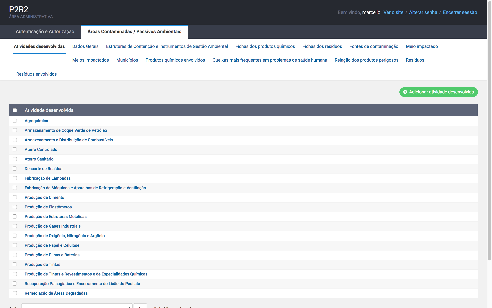

* **Fontes de Contaminação**: tipos de fontes de contaminação (galpaão de armazenamento, Piscina de metais pesados, etc.);

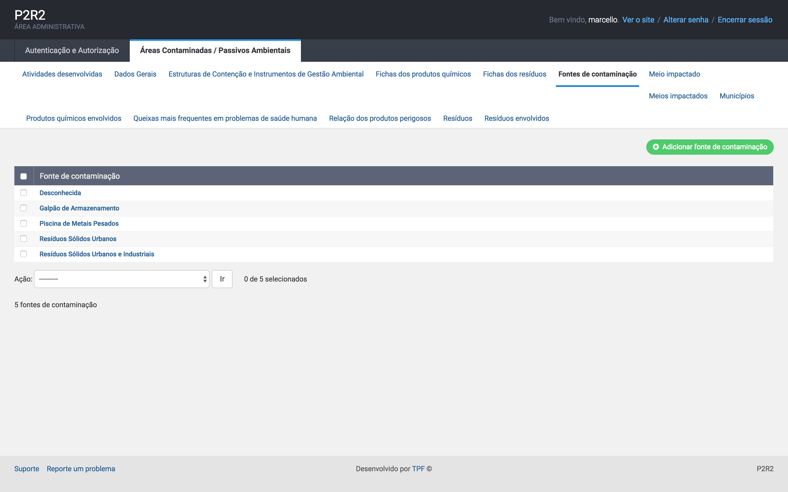

* **Meio Impactados**: tipos de meios impactados (ar, biota, solo, etc.);

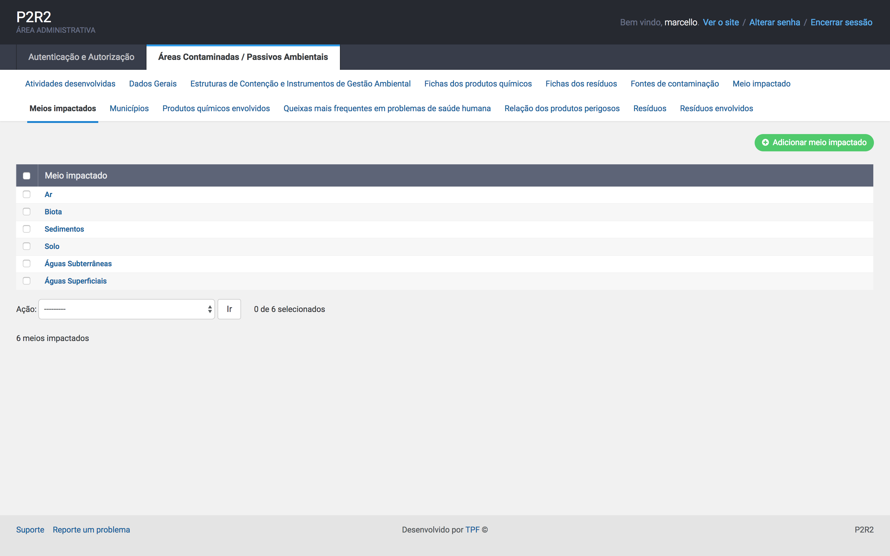
	
* **Queixas Mais Frequentes em Problemas de Saúde Humana**: contém os tipos de queixas (problemas dermatológicos, digestivos, etc.);

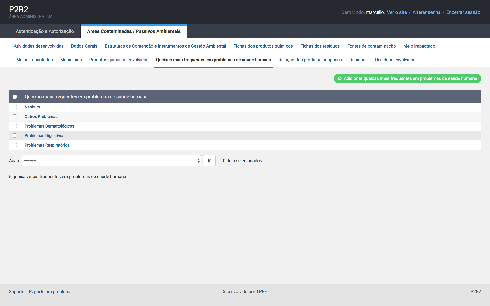
	
* **Fichas dos Protudos Químicos**: contém as fichas dos produtos químicos, bem como a sua descrição;

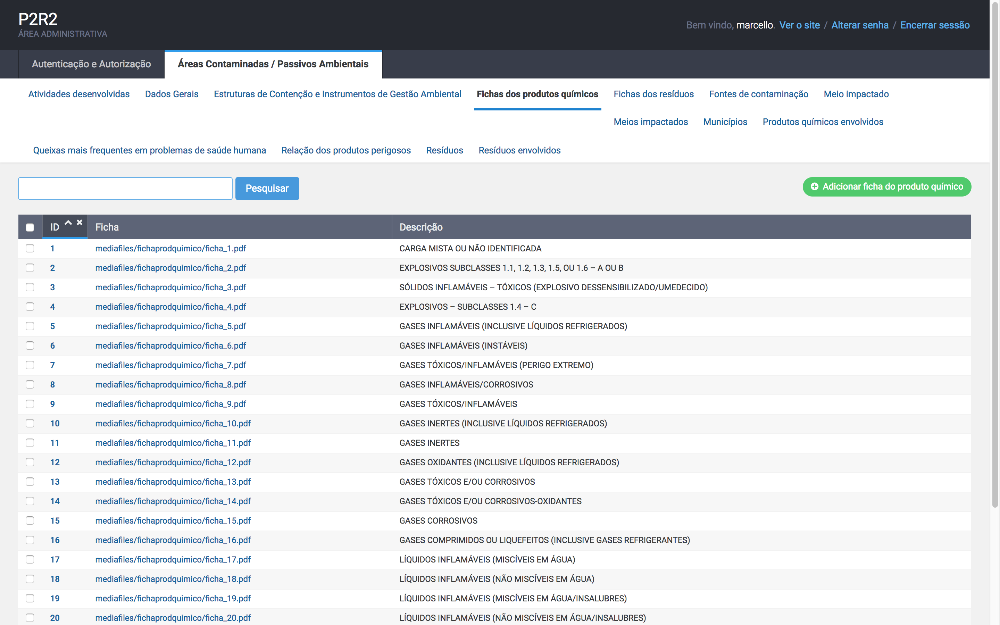

Exemplo de uma ficha: 

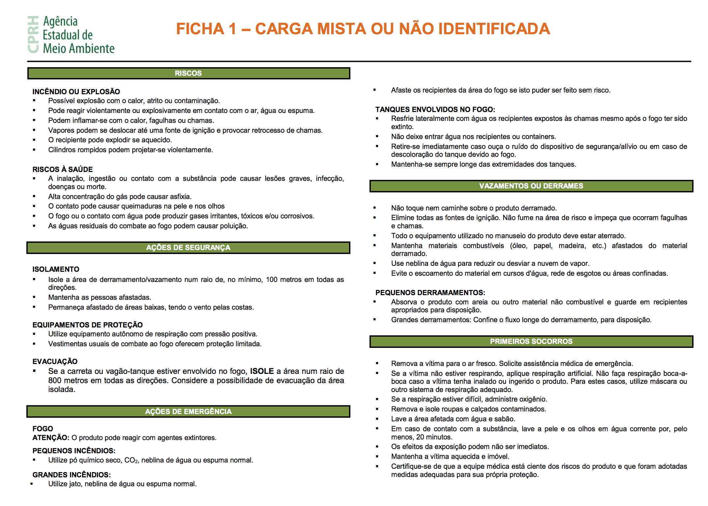

* **Relação dos Produtos Perigosos**: contém a relação dos produtos perigosos, sua classe de risco e associado a ele, a respectiva ficha do produto químico;

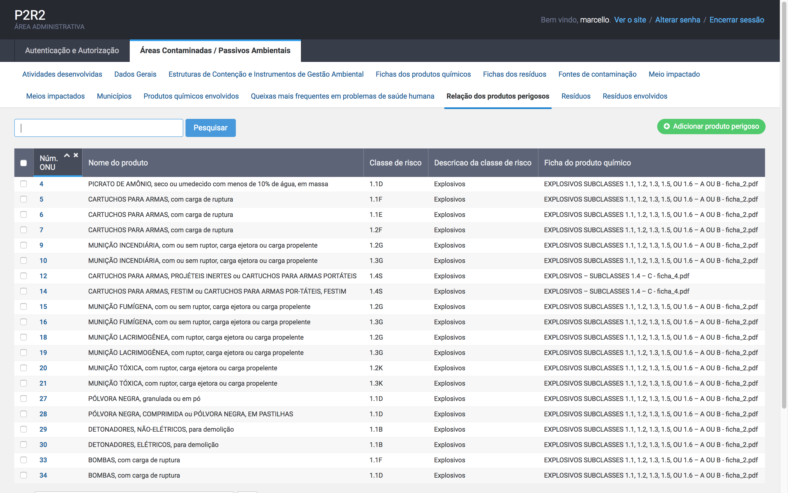
	
* **Municípios**: contém a relação dos municípios pernambucanos.

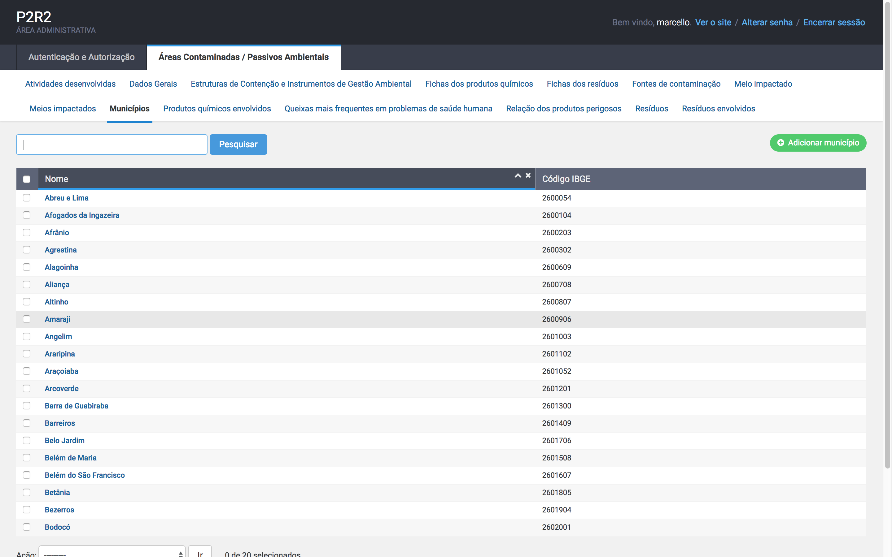

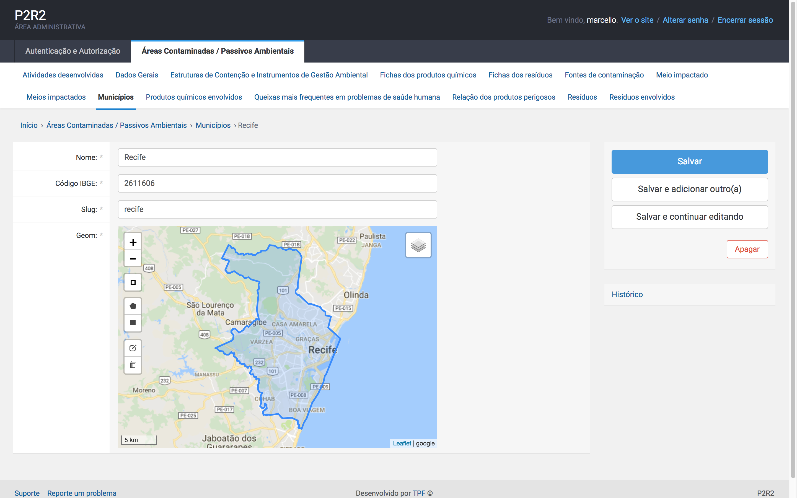

Um dos seis itens que compõem os itens principais do sistema, **Áreas Contamindadas / Passivos Ambientais** encontra-se finalizado, sendo descrito a seguir:

## 3. Áreas Contaminadas / Passivos Ambientais

O usuário ao clicar neste item do sistema, verá a tela abaixo:

### 3.1 - Dados Gerais:

Nesta tela serão preenchidos os dados gerais referentes ao cadastro das áreas contaminadas.

Também é possível adicionar o local do acidente através da fixação de um marcador no mapa utilizando a API do Google Maps, estão disponíveis as opções de visualização das imagens e também do mapa de ruas.

Uma vez preenchidos os dados, é possível filtrar (pesquisar) através dos valores contidos em qualquer uma das suas colunas, através do botão **pesquisar** mostrado na tela abaixo:

### 3.2 - Meio Impactado:

Uma vez cadastrado a aba de **Dados Gerais**, o próximo item a ser informado diz respeito ao **Meio Impactado** da área contaminada. As telas a seguir,

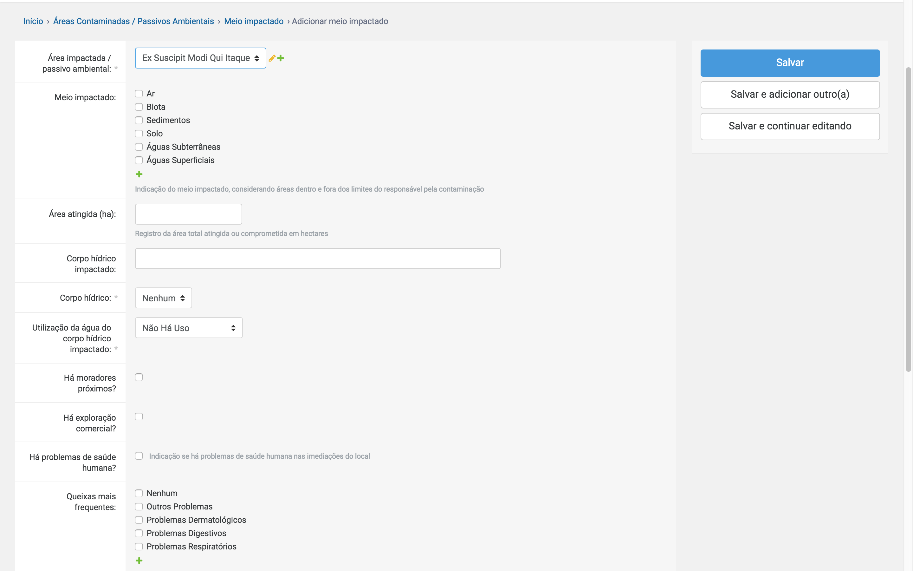

continuação do formulário:

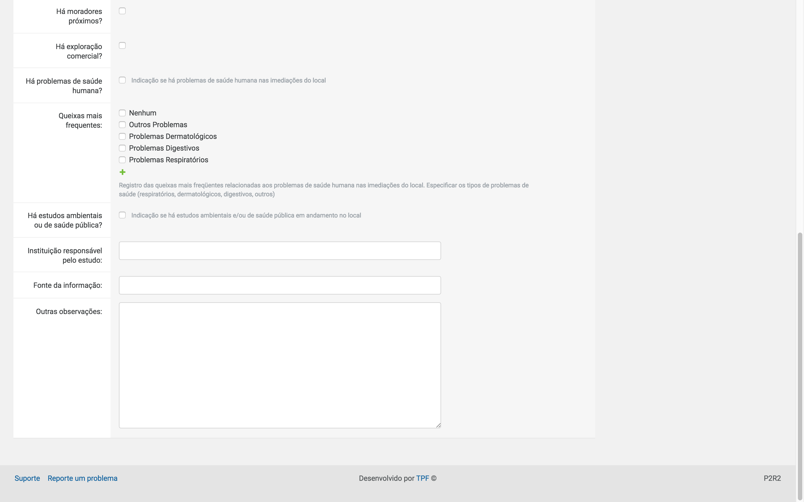

### 3.3 - Produtos Químicos Envolvidos:

Na sequência, o próximo item a ser cadastrado são os **Produtos Químicos Envolvidos**, o formulário abaixo mostra os campos a serem preenchidos:

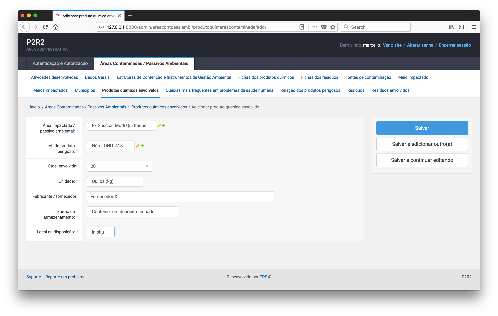

Nesta tela é possível escohles o nome do produto através do número ONU de referência do produto perigoso, como mostra a figura abaixo:

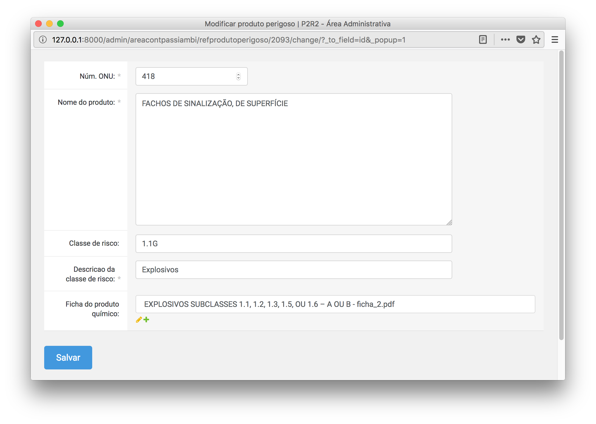

### 3.4 - Resíduos Envolvidos:

Também é possível cadastrar os resíduos envolvidos na(s) área(s) contaminada(s), através dos formulários a seguir:

### 3.5 - Estruturas de Contenção e Instrumentos de Gestão Ambiental:

Este formulário associa a área contaminada as informações de estruturas de contenção e instrumentos de gestão ambiental relacionadas a mesma.

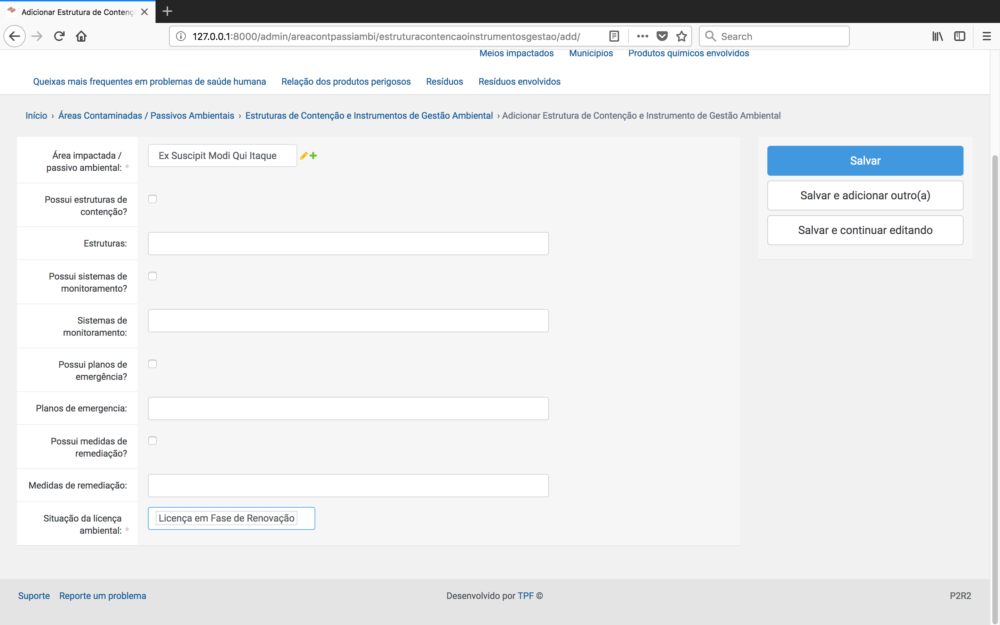

